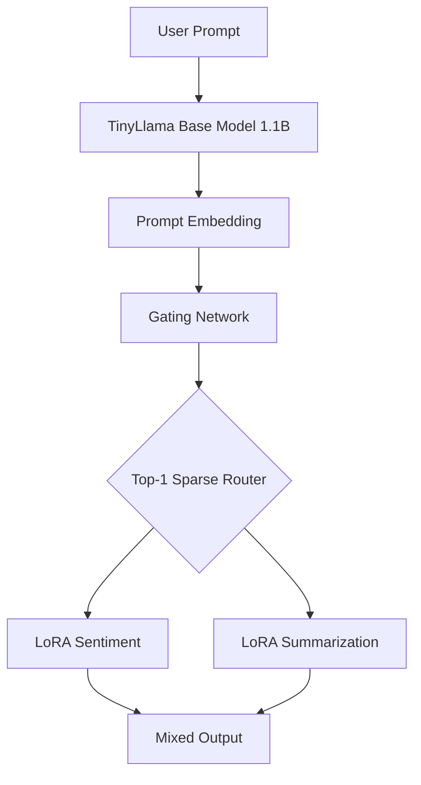

# 🚀 MixLoRA: Multi-Skill Language Models via Low-Rank Adapter Mixing

> **Blend multiple LoRA adapters → One model, many skills, minimal compute**

---

## 📌 Overview

Fine-tuning large language models for every new task is expensive and redundant. **LoRA (Low-Rank Adaptation)** enables lightweight task learning by training small adapters while keeping the base model frozen.

**MixLoRA** extends this idea by **blending multiple LoRA adapters at inference time**, producing a **multi-skilled model** without retraining the base network.

This project provides a **fully runnable implementation on 16 GB RAM** with:

* Task-specific LoRA adapters
* Learned gating network
* Sparse top-1 routing
* End-to-end inference pipeline

---

## 🎯 Original Objective

> *Implement the MixLoRA concept — blending multiple low-rank adaptation layers trained on different tasks to produce a multi-skilled model. Demonstrate combinations like sentiment + summarization while ensuring model reuse with minimal compute.*

---

## 🧠 Architecture



---

## 🛠 How LoRA Is Trained in This Project

LoRA adapters are trained **independently per task** while the base model is frozen.

### What is Trainable

| Component            | Updated?           |
| -------------------- | ------------------ |
| Base model weights   | ❌ Frozen           |
| LoRA matrices (A, B) | ✅ Trainable        |
| Gating network       | Trained separately |

### Training Objective

* Causal language modeling loss on task-specific text
* Target modules: `q_proj`, `v_proj`
* Each adapter learns one behavior (sentiment or summarization)

### Process

1. Attach LoRA to frozen model
2. Train only low-rank parameters
3. Save adapter
4. Repeat for next task

**Benefits:** minimal compute, no forgetting, reusable skills.

---

## ✨ Features

| Feature               | Description                |
| --------------------- | -------------------------- |
| Multi-Adapter Loading | Combine LoRAs in one model |
| Learned Routing       | Prompt-aware selection     |
| Sparse Top-1          | MoE-style efficiency       |
| Continual Design      | New skills plug-in         |
| 16 GB Friendly        | CPU-first                  |

---

## 🚀 Getting Started

### Prerequisites

| Requirement | Version  |
| ----------- | -------- |
| Python      | ≥ 3.9    |
| RAM         | 16 GB    |
| GPU         | Optional |

### Installation

```bash
pip install torch transformers peft datasets accelerate
```

### Run

```bash
jupyter notebook mixlora_notebook.ipynb
```

👉 **No manual edits required**

---

## 📤 Sample Results (Real-World Prompts)

### 1. Customer Support Triage

**Prompt**

```
Customer message:
"I waited 3 days for delivery. The product quality is good but your support team never replied. Can you summarize my issue and note the overall sentiment?"
```

**Routing**

| Adapter   | Weight |
| --------- | ------ |
| Sentiment | 0.45   |
| Summary   | 0.55   |

**Output**

> *“The customer reports delayed delivery and lack of support response while acknowledging good product quality, reflecting mixed but slightly negative sentiment.”*

---

### 2. App Review Digest

**Prompt**

```
Summarize this app store review in one line:
"The UI looks beautiful and payments are smooth, but the app crashes frequently on Android 13 and notifications don’t work."
```

**Routing**

| Adapter   | Weight |
| --------- | ------ |
| Sentiment | 0.20   |
| Summary   | 0.80   |

**Output**

> *“The app offers great design and payments but suffers from crashes and broken notifications on Android.”*

---

### 3. Sentiment Classification

**Prompt**

```
Classify the sentiment of this email:
"I’m extremely disappointed. I paid for premium but got basic features."
```

**Routing**

| Adapter   | Weight |
| --------- | ------ |
| Sentiment | 0.92   |
| Summary   | 0.08   |

**Output**

> *“The email expresses strong negative sentiment and frustration.”*

---

### 4. Product Feedback (Balanced)

**Prompt**

```
Give a short summary and highlight the tone:
"The laptop performance is great, but battery lasts only 3 hours."
```

**Routing**

| Adapter   | Weight |
| --------- | ------ |
| Sentiment | 0.50   |
| Summary   | 0.50   |

**Output**

> *“Good performance but poor battery life, indicating mixed sentiment.”*

---

## Design Justifications

* **Why not full fine-tuning?**
  Expensive + forgetting; MixLoRA enables reusable skills.

* **Why TinyLlama?**
  Fits 16 GB RAM while preserving concept validity.

* **Why sparse top-1?**
  Reduces interference and speeds inference.

* **Is gating supervised?**
  Yes—lightweight intent labels.

---

## ⚠ Troubleshooting

| Issue      | Fix              |
| ---------- | ---------------- |
| OOM        | `max_length=128` |
| Slow CPU   | First run caches |
| CUDA error | Auto CPU         |

---

## 🧠 Key Takeaway

> **MixLoRA enables multi-skill intelligence by blending lightweight adapters on a single frozen model with minimal compute.**

---

## 📜 License

Educational use; base model follows TinyLlama license.

---

**Author:** MixLoRA Prototype – 2025
